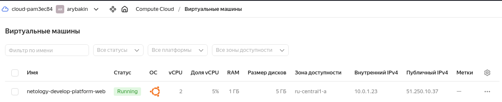
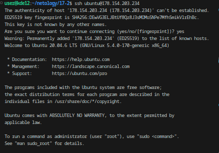
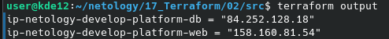

# Домашнее задание к занятию «Основы Terraform. Yandex Cloud» -Рыбакин Алексей

### Задание 1
В качестве ответа всегда полностью прикладывайте ваш terraform-код в git.  Убедитесь что ваша версия **Terraform** =1.5.Х (версия 1.6.Х может вызывать проблемы с Яндекс провайдером) 

1. Изучите проект. В файле variables.tf объявлены переменные для Yandex provider.
2. Создайте сервисный аккаунт и ключ. [service_account_key_file](https://terraform-provider.yandexcloud.net).
4. Сгенерируйте новый или используйте свой текущий ssh-ключ. Запишите его открытую(public) часть в переменную **vms_ssh_public_root_key**.
5. Инициализируйте проект, выполните код. Исправьте намеренно допущенные синтаксические ошибки. Ищите внимательно, посимвольно. Ответьте, в чём заключается их суть.

```
В Строке platform_id = "standart-v4" две ошибки, синтаксическая и ошибка выбора платформы, согласно документации v4 не существует, для наших нужд разумно будет выбрать v1
Исправленная орфографическая ошибка в platform_id = "standard-v1". 
В описании ресурсов создаваемой ВМ так же есть ошибка в cores = 1, согласно документации минимальное значение 2

```

6. Подключитесь к консоли ВМ через ssh и выполните команду ``` curl ifconfig.me```.
Примечание: К OS ubuntu "out of a box, те из коробки" необходимо подключаться под пользователем ubuntu: ```"ssh ubuntu@vm_ip_address"```. Предварительно убедитесь, что ваш ключ добавлен в ssh-агент: ```eval $(ssh-agent) && ssh-add``` Вы познакомитесь с тем как при создании ВМ создать своего пользователя в блоке metadata в следующей лекции.;
8. Ответьте, как в процессе обучения могут пригодиться параметры ```preemptible = true``` и ```core_fraction=5``` в параметрах ВМ.

```
preemptible = true создаёт прерываемую ВМ, которая дешевле, которая, это выгодно для обучения.

core_fraction=5 создаёт ВМ, которая будет иметь доступ к физическим ядрам как минимум 5% времени. Тоже ывгодна для обучения.
```

В качестве решения приложите:

- скриншот ЛК Yandex Cloud с созданной ВМ, где видно внешний ip-адрес;



- скриншот консоли, curl должен отобразить тот же внешний ip-адрес;



- ответы на вопросы.

### Задание 2

1. Замените все хардкод-**значения** для ресурсов **yandex_compute_image** и **yandex_compute_instance** на **отдельные** переменные. К названиям переменных ВМ добавьте в начало префикс **vm_web_** .  Пример: **vm_web_name**.
2. Объявите нужные переменные в файле variables.tf, обязательно указывайте тип переменной. Заполните их **default** прежними значениями из main.tf. 
3. Проверьте terraform plan. Изменений быть не должно. 

```

```

### Задание 3

1. Создайте в корне проекта файл 'vms_platform.tf' . Перенесите в него все переменные первой ВМ.
2. Скопируйте блок ресурса и создайте с его помощью вторую ВМ в файле main.tf: **"netology-develop-platform-db"** ,  ```cores  = 2, memory = 2, core_fraction = 20```. Объявите её переменные с префиксом **vm_db_** в том же файле ('vms_platform.tf').  ВМ должна работать в зоне "ru-central1-b"
3. Примените изменения.

```

```

### Задание 4

1. Объявите в файле outputs.tf **один** output , содержащий: instance_name, external_ip, fqdn для каждой из ВМ в удобном лично для вас формате.

```
output "ip-netology-develop-platform-db" { 
  value = yandex_compute_instance.platform.network_interface[0].nat_ip_address
}
output "ip-netology-develop-platform-web" { 
  value = yandex_compute_instance.platform-db.network_interface[0].nat_ip_address
}
```

2. Примените изменения.

В качестве решения приложите вывод значений ip-адресов команды ```terraform output```.



### Задание 5

1. В файле locals.tf опишите в **одном** local-блоке имя каждой ВМ, используйте интерполяцию ${..} с НЕСКОЛЬКИМИ переменными по примеру из лекции.

```
locals {
  web-name = "web-${var.vpc_name}-${var.vm_db_instance_name}-cf${var.vm_web_core}"
  db-name = "db-${var.vpc_name}-${var.vm_db_instance_name}-cf${var.vm_db_core}"
}
```
2. Замените переменные внутри ресурса ВМ на созданные вами local-переменные.
3. Примените изменения.

```
name        = local.web_name
name        = local.db_name
```

### Задание 6

1. Вместо использования трёх переменных  ".._cores",".._memory",".._core_fraction" в блоке  resources {...}, объедините их в единую map-переменную **vms_resources** и  внутри неё конфиги обеих ВМ в виде вложенного map.  

```
variable "vms_resources" {
  type = map(number)
  default = {"vm_web_resources" = {
    cores = 2
    memory = 1
    core = 5
    }
    "vm_db_resources" = {
    cores = 2
    memory = 2
    core = 20
    }    
  }
}
```

```
  resources {
    cores         = var.vms_resources.vm_web_cores
    memory        = var.vms_resources.vm_web_memory
    core_fraction = var.vms_resources.vm_web_core
  }

  resources {
    cores         = var.vms_resources.vm_db_cores
    memory        = var.vms_resources.vm_db_memory
    core_fraction = var.vms_resources.vm_db_core
  } 
```

3. Создайте и используйте отдельную map переменную для блока metadata, она должна быть общая для всех ваших ВМ.

```
variable "vms_metadata" {
  type = map(string)
  default = {
    serial-port-enable = 1
    ssh-keys           = "ubuntu:ssh-ed25519 AAAAC3NzaC1lZDI1NTE5AAAAIIcctq4cYZC5AZ0OF/5Du8i+h0zP4gwLe8/2gk2cTh66"
    description        = "ssh-keygen -t ed25519"
  }
}
```  
  
5. Найдите и закоментируйте все, более не используемые переменные проекта.
6. Проверьте terraform plan. Изменений быть не должно.
